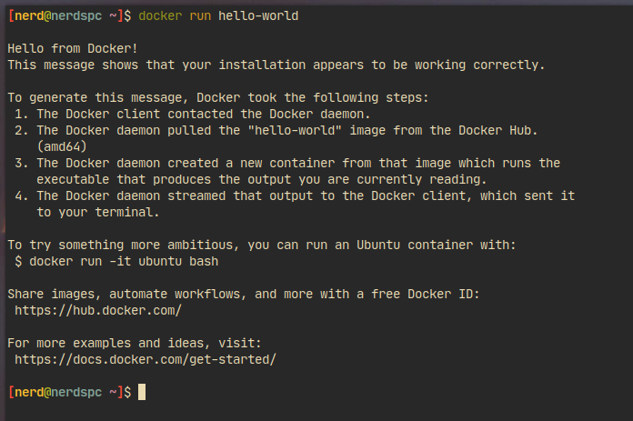

## Introduction to Docker

Docker is a tool for containerizing software. Unlike traditional virtual machines which are heavy on resources and bulky docker containers run parallel to the host operating system.

### Why use it?

Docker lets you quickly pack, ship and run any application as a Docker image which can uploaded to a registry and can be pulled down at any time.

### Installation

Depending on your operating system installation instructions may differ, consult https://docs.docker.com/engine/install

### First container

Lets run

```bash
$ docker run hello-world
```

You should see something like this



### Dockerizing a node.js web server

Let's move onto something a bit more complicated

I'll make a new directory called web-server and create a basic express server

```sh
$ mkdir web-server
$ cd web-server
$ npm init -y && npm i express
$ vim app.js
```

Add the following code into app.js

```js
const express = require("express");
const app = express();
app.listen(3000);
app.get("/", (req, res) => {
  res.send("Hello from docker 🐋");
});
```

Now lets write our Dockerfile, a Dockerfile lets us set the rules for which our docker image is built from

```
FROM node:alpine
COPY . .
RUN npm i
CMD ["node", "app"]
```

We also want to make sure node_modules/ doesn't get copied over so make a file in the root of your directory called `.dockerignore` and add `node_modules` in it.

Now lets build and run our image

```sh
$ docker build -t webserver .
$ docker run -p 3000:3000 webserver
```

Now we can visit our nodejs web server from our browser!
